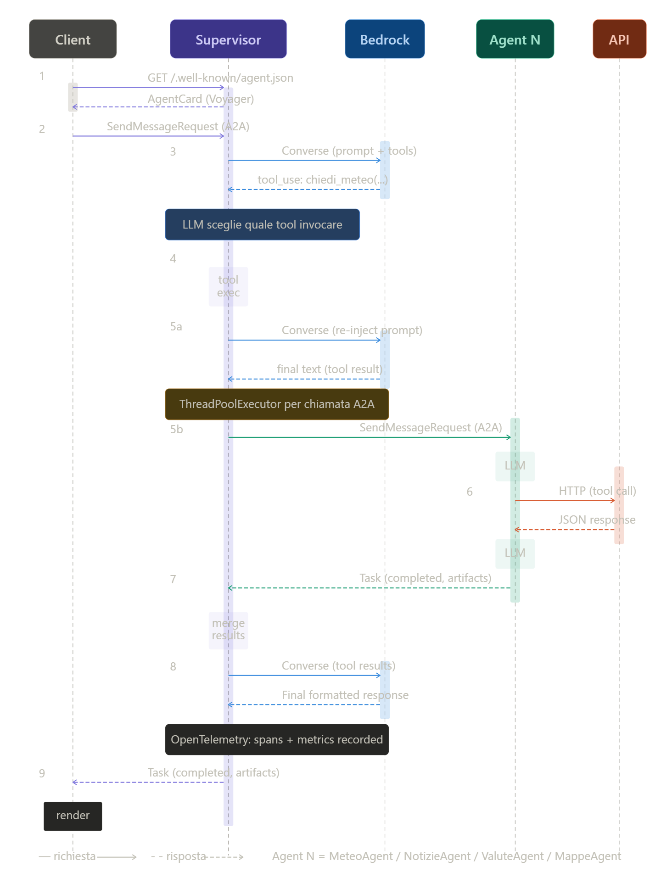
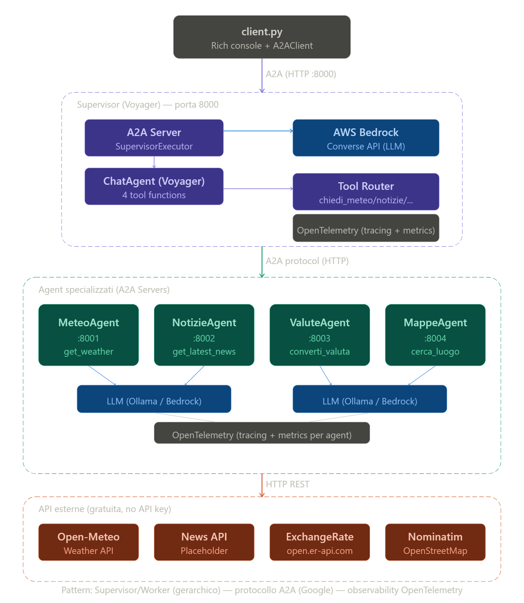

# Architetture Agentiche a Confronto
## Multi-Agent A2A vs Single-Agent con Skills dinamiche

> Documento tecnico basato sull'analisi dei progetti `01_a2a_multi-agent_demo` e `02_skills_demo`.

---

## Indice

1. [Definizioni](#1-Architetture-Agentiche)
   - 1.1 [Multi-Agent con comunicazione A2A](#11-multi-agent-con-comunicazione-a2a)
   - 1.2 [Single-Agent con Skills dinamiche](#12-single-agent-con-skills-dinamiche)
2. [Confronto architetturale](#2-confronto-architetturale)
3. [Pro e Contro](#3-pro-e-contro)
   - 3.1 [Multi-Agent A2A](#31-multi-agent-a2a--pro-e-contro)
   - 3.2 [Single-Agent con Skills](#32-single-agent-con-skills--pro-e-contro)
4. [Quando scegliere quale approccio](#4-quando-scegliere-quale-approccio)
5. [Dati osservati nei test](#5-dati-osservati-nei-test)

---

## 1. Architetture Agentiche

### 1.1 Multi-Agent con comunicazione A2A
Un sistema **multi-agent** è un'architettura distribuita in cui ogni capacità del sistema è incapsulata in un agente autonomo e indipendente, ciascuno eseguito come processo separato con il proprio ciclo di vita, modello LLM e stack di dipendenze. Gli agenti comunicano tra loro attraverso un protocollo standardizzato di messaggistica — in questo caso **A2A (Agent-to-Agent)**, sviluppato da Google — che definisce un'interfaccia HTTP uniforme tramite la quale gli agenti si scoprono a vicenda, dichiarano le proprie capacità e si scambiano task e risposte.

**Struttura del sistema multi-agente (preso come riferimento il progetto `01_a2a_multi-agent_demo`):**

#### Funzionamento

Il supervisore non conosce a priori l'implementazione degli agenti. Al momento della chiamata, recupera dinamicamente la **AgentCard** dell'agente target — un documento JSON esposto all'endpoint `/.well-known/agent.json` — che dichiara nome, versione, capabilities, modalità di input/output e skill disponibili. Sulla base di questa auto-descrizione, il supervisore costruisce e invia un `SendMessageRequest` A2A. L'agente riceve la richiesta, la elabora autonomamente e restituisce un `Task` completato con gli artefatti di risposta.

La propagazione del contesto distribuito avviene tramite header **W3C TraceContext** (`traceparent`) iniettati in ogni chiamata HTTP, permettendo la ricostruzione della trace end-to-end in sistemi come Jaeger.

#### Sequence Diagram

      

#### Architettura Applicativa

      

L'applicazione implementa il pattern Supervisor/Worker (gerarchico) con protocollo A2A (Agent-to-Agent di Google). Il flusso implementato prevede:

1. Il Client scopre il Supervisor via /.well-known/agent.json, poi invia richieste A2A

2. Il Supervisor (Voyager) su porta 8000 usa un ChatAgent con AWS Bedrock come LLM, che decide quale tool invocare (chiedi_meteo, chiedi_notizie, chiedi_valute, chiedi_mappe)

3. Ogni tool function esegue una chiamata A2A al rispettivo agent specializzato tramite ThreadPoolExecutor + asyncio.run

4. Ogni Agent specializzato (porte 8001-8004) ha il proprio ChatAgent con LLM (Ollama o Bedrock), tool interni che chiamano API esterne (ExchangeRate, Nominatim/OpenStreetMap, ecc.), e restituisce un Task con artifacts

5. Il Supervisor raccoglie i risultati, li passa a Bedrock per una sintesi finale, e restituisce la risposta al Client

6. OpenTelemetry è integrato a ogni livello per tracing distribuito e metriche

Tutte le comunicazioni tra il supervisor e gli agenti avvengono esclusivamente via A2A protocol, rendendo ogni agente indipendente e sostituibile.

### 1.2 Single-Agent con Skills dinamiche

Un sistema **single-agent con skills dinamiche** è un'architettura monolitica in-process in cui un unico agente supervisore ingloba tutte le capacità del sistema sotto forma di **skill** — classi Python caricate dinamicamente a runtime. Non esistono processi separati né comunicazione di rete interna. Ogni skill è un modulo autonomo che incapsula il proprio LLM, i propri tool e la propria logica, ma viene istanziato e invocato direttamente all'interno del processo del supervisore.

La caratteristica distintiva di questa implementazione è la **SKILL.md discovery**: ogni skill si autodescrive tramite un file Markdown con frontmatter YAML che contiene metadati, istruzioni per il LLM supervisore e la documentazione del dominio. Il supervisore costruisce il proprio system prompt, la propria AgentCard e i propri tool **esclusivamente** leggendo questi file, senza alcuna configurazione hardcoded.

**Struttura del sistema mono-agente (preso come riferimento il progetto `02_skills_demo`):**

#### Funzionamento

Al boot, il `SkillLoader` scansiona la directory `skills/`, trova ogni sottocartella con un `SKILL.md`, ne fa il parsing del frontmatter YAML, importa dinamicamente la classe Python corrispondente via `importlib`, istanzia la skill e inietta in essa un `AgentMetrics` e un `Tracer` OpenTelemetry dedicati. Costruisce poi per ogni skill un `@ai_function` wrapper — con nome e docstring estratti dal SKILL.md — che fa da ponte tra il LLM supervisore e la skill.

Quando il supervisore riceve una richiesta, il LLM (Bedrock) analizza il testo e decide quale tool invocare. L'invocazione è una chiamata Python sincrona diretta: nessuna rete, nessuna serializzazione HTTP. La skill esegue il proprio agente Ollama in un thread separato (via `ThreadPoolExecutor`) per non bloccare l'event loop di uvicorn.

#### Sequence Diagram

#### Architettura Applicativa

Approccio Skills (mono-agente) — un singolo processo Python su porta 9000 che contiene tutto:

1. Il SkillLoader al boot scansiona skills/*/SKILL.md, scopre le skill disponibili, e registra dinamicamente i tool nel ChatAgent del Supervisor

2. Ogni Skill (Meteo, Notizie, Valute, Mappe) è una classe Python che estende BaseSkill, con il proprio ChatAgent interno e i propri tool

3. Le skill vengono chiamate in-process (nessuna comunicazione di rete, nessun handoff HTTP) — il Supervisor invoca direttamente i metodi Python

Aggiungere una nuova skill = creare una cartella skills/nome/ con SKILL.md + classe. Zero modifiche al codice del supervisor. L'A2A protocol viene usato solo per la comunicazione Client → Supervisor

Rispetto alla versione A2A multi-agent: nessuna latenza di rete interna, un solo processo da gestire, nessun service discovery runtime. Il trade-off è che non puoi scalare le skill indipendentemente e un crash nel processo blocca tutto.

## 2. Confronto tra le due architetture

| Dimensione | Multi-Agent A2A | Single-Agent + Skills |
|---|---|---|
| **Processi** | 5 (1 supervisor + 4 agenti) | 1 |
| **Porte di rete** | 8000, 8001, 8002, 8003, 8004 | 9000 |
| **Comunicazione interna** | HTTP/REST (A2A protocol) | Chiamata Python diretta |
| **Serializzazione** | JSON su socket TCP | Nessuna |
| **Scoperta capabilities** | AgentCard via HTTP | SKILL.md via filesystem |
| **Configurazione supervisor** | Hardcoded (URL agenti, tool names) | Automatica da SKILL.md |
| **System prompt supervisor** | Hardcoded nel codice | Generato dai corpi SKILL.md |
| **Aggiungere una nuova unit** | Nuovo processo + modifica supervisor | Nuova cartella con SKILL.md |
| **LLM supervisor** | Amazon Bedrock | Amazon Bedrock |
| **LLM unità specializzate** | Ollama (per agente) | Ollama (per skill) |
| **Overhead di rete interno** | Sì (round-trip HTTP per ogni delega) | No |
| **Latenza media osservata** | ~5.27s | ~3.50s |
| **Isolamento dei fault** | Totale (crash di un agente non abbatte il sistema) | Parziale (errore di una skill è una eccezione nel processo) |
| **Scalabilità orizzontale** | Nativa (ogni agente scalabile indipendentemente) | Richiede replica dell'intero processo |
| **Telemetria distribuita** | Trace end-to-end con propagazione W3C | Span in-process, nessuna propagazione rete |
| **Wire latency misurabile** | Sì (kind="wire" vs kind="total") | Non applicabile |

---

## 3. Pro e Contro

### 3.1 Multi-Agent A2A — Pro e Contro

#### ✅ Pro

**Isolamento e fault tolerance reale.**
Ogni agente è un processo separato con il proprio spazio di memoria, dipendenze e ciclo di vita. Se `ValuteAgent` crasha — per un timeout verso ExchangeRate-API, per un bug, per esaurimento memoria — gli altri agenti continuano a funzionare indisturbati. Il supervisore riceve un errore da quel tool specifico e può gestirlo (risposta di fallback, retry, log) senza perdere l'intera sessione utente.

**Scalabilità indipendente per dominio.**
Se le domande sul meteo crescono di 10x rispetto alle domande sulle valute, si possono avviare 3 istanze di `MeteoAgent` dietro un load balancer senza toccare gli altri agenti. Ogni componente scala in base alla propria domanda reale, non alla domanda aggregata del sistema.

**Eterogeneità tecnologica.**
Ogni agente può essere scritto in un linguaggio diverso, usare un modello LLM diverso, deployare su hardware diverso (GPU dedicata per il modello più pesante, CPU economica per i placeholder). Il contratto è solo il protocollo A2A: l'implementazione interna è libera.

**Aggiornamenti senza downtime.**
Si può aggiornare `NotizieAgent` a una versione più recente — con un modello LLM migliore, tool reali al posto di placeholder — senza riavviare il supervisore o gli altri agenti. La nuova versione espone la stessa AgentCard, il supervisore continua a funzionare.

**Tracciabilità distribuita completa.**
La propagazione del `traceparent` W3C attraverso le chiamate HTTP permette di ricostruire in Jaeger la trace completa: si vede esattamente quanto tempo ha impiegato il supervisore, quanto ha impiegato la chiamata di rete, quanto ha impiegato l'agente a elaborare. Questo rende possibile individuare il collo di bottiglia esatto nel pipeline.

**Standard interoperabile.**
Il protocollo A2A è un standard emergente (Google, 2025). Un agente scritto con A2A può essere sostituito da un agente di un altro vendor o framework che implementa lo stesso protocollo, senza modificare il supervisore.

---

#### ❌ Contro

**Complessità operativa elevata.**
Per eseguire il sistema completo servono 5 processi, 5 porte di rete, 5 file di log da monitorare, 5 processi da riavviare in caso di crash. In sviluppo questo è scomodo; in produzione richiede un orchestratore (Kubernetes, Docker Compose, Supervisor process manager) e una strategia di health check per ogni agente.

**Overhead di latenza misurabile.**
Ogni delega dal supervisore a un agente richiede: risoluzione dell'AgentCard (HTTP GET), invio della richiesta (HTTP POST con serializzazione JSON), ricezione e deserializzazione della risposta. Nei test questo overhead ha prodotto una latenza media di ~5.27s contro ~3.50s delle Skills — un aumento del 51% sulla latenza assoluta, o equivalentemente: le Skills sono il 33% più veloci. Per richieste che delegano a più agenti (categoria "misto"), l'overhead si accumula.

**Ordine di avvio obbligatorio.**
Il supervisore deve trovare gli agenti già attivi quando si connette. Se un agente non è ancora in ascolto sulla propria porta, la prima chiamata fallisce. In ambienti di sviluppo questo richiede attenzione all'ordine di avvio dei terminali; in produzione richiede readiness probe e retry logic.

**Duplicazione del codice di boilerplate.**
Ogni agente replica la stessa struttura: `AgentExecutor`, estrazione del testo dal `context.message`, gestione del token usage, costruzione dell'`Artifact` di risposta. Nelle versioni attuali del progetto questo codice è incollato in tutti e 4 gli agenti, rendendo le modifiche trasversali (es. aggiungere un nuovo campo alla risposta) laboriose e soggette a dimenticanze.

**Debugging più difficile.**
Un bug in produzione richiede di correlare log da 5 processi separati, identificare la trace distribuita in Jaeger, e capire quale componente ha causato il problema. Senza un sistema di osservabilità ben configurato (come quello implementato con OpenTelemetry), il debugging diventa molto più complesso rispetto a un singolo processo con un unico stack trace.

---

### 3.2 Single-Agent con Skills — Pro e Contro

#### ✅ Pro

**Semplicità operativa totale.**
Un solo processo da avviare, un solo log da monitorare, un solo health check, una sola porta di rete. Per eseguire l'intero sistema in sviluppo basta `python supervisor/supervisor.py`. In produzione basta un singolo container.

**Latenza inferiore.**
Eliminando il round-trip HTTP interno, la latenza media si riduce da ~5.27s a ~3.50s — un miglioramento del 33% misurato in condizioni identiche. Per categorie miste (che richiedono più deleghe) il vantaggio è ancora maggiore: da 7.41s a 4.25s (+74% di velocità). Questo guadagno è particolarmente rilevante per applicazioni interattive dove la latenza percepita dall'utente è critica.

**Estensibilità senza toccare il codice del supervisor.**
Aggiungere una nuova skill significa creare una cartella con `SKILL.md` e il file Python della skill. Al prossimo avvio il supervisore la scopre, la carica, aggiorna il proprio system prompt, aggiorna l'AgentCard e la rende disponibile come tool. Zero modifiche al codice esistente. Questo è il vantaggio principale dell'architettura rispetto a una versione naive di single-agent senza discovery.

**Iniezione di istruzioni dal dominio.**
Il corpo Markdown del `SKILL.md` viene iniettato nel system prompt del supervisore. Questo significa che le istruzioni su "quando usare questa skill", "quali tipi di domande gestisce", "quali sono i suoi limiti" sono scritte dai domain expert e mantenute insieme al codice della skill, non disperse nel codice del supervisore. La qualità del routing del LLM migliora con istruzioni precise e contestuali.

**Telemetria a due livelli senza infrastruttura distribuita.**
Grazie all'iniezione di `AgentMetrics` dedicati per ogni skill, le metriche mostrano sia la latenza end-to-end del supervisore sia la latenza interna di ogni singola skill — tutto da un unico processo, senza bisogno di propagazione di trace attraverso la rete.

**Debugging immediato.**
Un singolo stack trace Python contiene l'intera catena di chiamata: supervisor → skill → tool → risposta. Non serve correlare log da processi diversi o ricostruire trace distribuite.

---

#### ❌ Contro

**Fault isolation assente.**
Se una skill solleva un'eccezione non gestita — un timeout verso Nominatim, un bug nel codice della skill, un'eccezione nel modello Ollama — l'eccezione si propaga fino al supervisor e, se non correttamente gestita, può abbattere l'intera richiesta o in casi estremi il processo. Non c'è separazione di memoria o di fault domain tra skill diverse. Un bug catastrofico in `MappeSkill` (es. un loop infinito, un consumo anomalo di memoria) impatta tutte le altre skill.

**Scalabilità non granulare.**
Non è possibile scalare una singola skill in modo indipendente. Se `ValuteSkill` diventa il collo di bottiglia per un aumento del traffico sulle domande di valute, l'unica opzione è replicare l'intero processo del supervisore — con tutte le skill, incluse quelle non sotto pressione. Questo è inefficiente in termini di risorse.

**Eterogeneità tecnologica impossibile.**
Tutte le skill devono essere scritte in Python e devono girare nello stesso processo. Non è possibile avere una skill scritta in Go, una in Java, una che gira su una macchina diversa con GPU dedicata. Tutto il codice deve coesistere nello stesso ambiente Python con le stesse dipendenze, rischiando conflitti di versione.

**Il `ThreadPoolExecutor` introduce un vincolo nascosto.**
Poiché `BaseSkill.execute()` è un metodo sincrono chiamato da un tool sincrono, ma `ChatAgent.run()` è una coroutine, è necessario eseguire la coroutine in un thread separato per non bloccare l'event loop di uvicorn. Questo meccanismo funziona ma introduce un overhead di context switching e limita il numero di skill eseguibili in parallelo al pool size del `ThreadPoolExecutor`. In scenari di alta concorrenza questo può diventare un collo di bottiglia.

**Aggiornamenti richiedono riavvio completo.**
Per aggiornare la logica di una skill — anche solo la docstring nel `SKILL.md` — è necessario riavviare l'intero processo del supervisore, interrompendo tutte le sessioni attive. Nell'architettura A2A lo stesso aggiornamento richiederebbe solo il riavvio di un singolo agente.

**Il discovery è locale al filesystem.**
Le skill devono risiedere sullo stesso filesystem del supervisor. Non è possibile caricare una skill da un servizio remoto, da un repository esterno o da un pacchetto distribuito indipendentemente. Questo limita i pattern di distribuzione in ambienti cloud-native.

---

## 4. Quando scegliere quale approccio

### Scegliere Multi-Agent A2A quando:

- Il sistema deve essere **fault-tolerant**: un dominio non disponibile non deve bloccare gli altri
- Ci sono **team separati** che gestiscono domini separati e devono poter deployare in modo indipendente
- Il sistema deve crescere verso **centinaia di agenti** specializzati gestiti da organizzazioni diverse
- I diversi domini richiedono **modelli LLM diversi**, hardware diverso o linguaggi di programmazione diversi
- Il contesto è **enterprise/multi-tenant** dove l'isolamento tra componenti è un requisito di sicurezza o compliance
- Serve **scalabilità orizzontale granulare** per gestire picchi di traffico asimmetrici tra domini

### Scegliere Single-Agent + Skills quando:

- Il sistema è gestito da **un unico team** e i domini sono relativamente stabili
- La **latenza percepita dall'utente** è critica e ogni millisecondo conta (applicazioni conversazionali real-time)
- Si vuole massimizzare la **semplicità operativa** minimizzando l'infrastruttura
- Le skill sono in numero limitato (fino a ~20) e possono coesistere nello stesso processo senza conflitti
- Il progetto è in fase di **prototipazione o MVP** e si vuole iterare rapidamente senza overhead infrastrutturale
- Le skill sono funzionalmente omogenee e richiedono lo stesso stack tecnologico (Python + stessa versione delle librerie)

---

## 5. Dati osservati nei test

I seguenti dati sono stati misurati con il benchmark `traffic_simulator_benchmark.py` inviando le stesse domande in parallelo a entrambi i sistemi (72 richieste totali, 3 cicli, modalità random, domande su 5 categorie).

| Metrica | Multi-Agent A2A | Single-Agent Skills | Δ |
|---|---|---|---|
| Richieste totali | 72 | 72 | — |
| Successi | 72 | 72 | — |
| Errori | 0 | 0 | — |
| **Latenza media** | **5.27s** | **3.50s** | Skills -33.6% |
| Latenza minima | 2.18s | 1.48s | Skills -32.1% |
| Latenza massima | 13.68s | 11.03s | Skills -19.4% |
| **P95** | **11.35s** | **6.75s** | **Skills -40.5%** |

### Per categoria:

| Categoria | A2A avg | Skills avg | Vincitore | Δ assoluto |
|---|---|---|---|---|
| Mappe | 5.17s | 3.37s | Skills | -1.80s |
| Meteo | 3.58s | 3.71s | A2A | +0.13s |
| **Misto** | **7.41s** | **4.25s** | **Skills** | **-3.16s** |
| Notizie | 5.86s | 3.16s | Skills | -2.70s |
| Valute | 4.77s | 3.16s | Skills | -1.61s |

**Nota sulla categoria "meteo":** L'unica categoria dove A2A risulta marginalmente più veloce (0.13s, trascurabile) è probabilmente dovuta a varianza statistica nel campione ridotto. L'agente Meteo usa tool placeholder (nessuna chiamata esterna reale), quindi il suo tempo di elaborazione è quasi interamente LLM — identico tra le due architetture.

**Nota sulla categoria "misto":** Il vantaggio delle Skills è massimo qui (+74% di velocità rispetto all'A2A) perché le domande miste richiedono 2-4 deleghe. Nell'A2A ogni delega aggiunge un round-trip HTTP; nelle Skills ogni delega è una chiamata in-process. Il vantaggio si moltiplica linearmente con il numero di deleghe.

---

*Documento redatto il 27 marzo 2026 — analisi basata sul codice sorgente e sui dati di benchmark dei progetti `01_a2a_multi-agent_demo` e `02_skills_demo`.*
