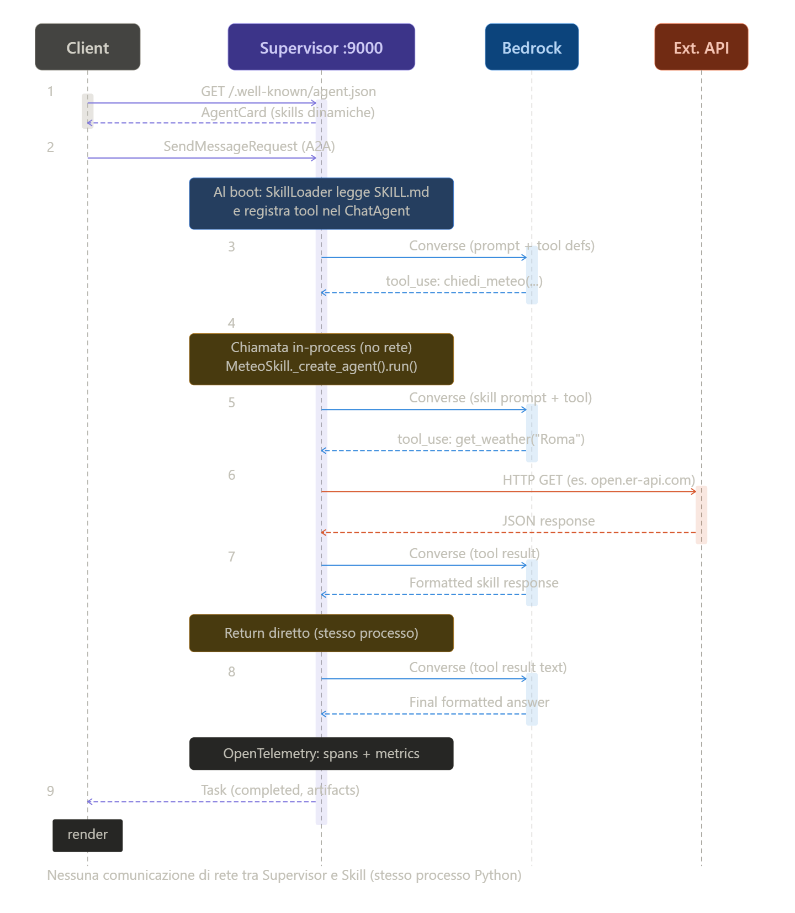
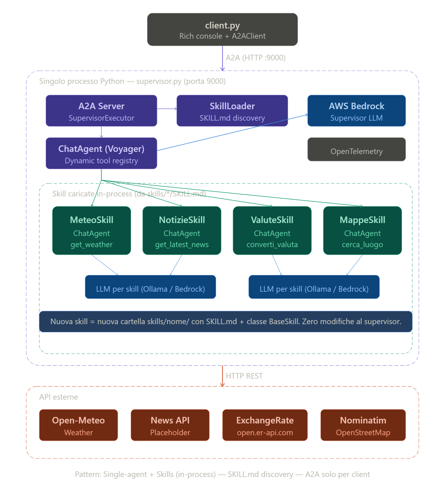

# Architetture Agentiche a Confronto

## Multi-Agent A2A vs Single-Agent con Skills dinamiche

---

## Architetture Agentiche

### Multi-Agent con comunicazione A2A
Un sistema **multi-agent** è un'architettura distribuita in cui ogni capacità del sistema è incapsulata in un agente autonomo e indipendente, ciascuno eseguito come processo separato con il proprio ciclo di vita, modello LLM e stack di dipendenze. Gli agenti comunicano tra loro attraverso un protocollo standardizzato di messaggistica — in questo caso **A2A (Agent-to-Agent)**, sviluppato da Google — che definisce un'interfaccia HTTP uniforme tramite la quale gli agenti si scoprono a vicenda, dichiarano le proprie capacità e si scambiano task e risposte.

**Struttura del sistema multi-agente (preso come riferimento il progetto `01_a2a_multi-agent_demo`):**

#### Funzionamento

Il supervisore non conosce a priori l'implementazione degli agenti. Al momento della chiamata, recupera dinamicamente la **AgentCard** dell'agente target — un documento JSON esposto all'endpoint `/.well-known/agent.json` — che dichiara nome, versione, capabilities, modalità di input/output e skill disponibili. Sulla base di questa auto-descrizione, il supervisore costruisce e invia un `SendMessageRequest` A2A. L'agente riceve la richiesta, la elabora autonomamente e restituisce un `Task` completato con gli artefatti di risposta.

La propagazione del contesto distribuito avviene tramite header **W3C TraceContext** (`traceparent`) iniettati in ogni chiamata HTTP, permettendo la ricostruzione della trace end-to-end in sistemi come Jaeger.

#### Sequence Diagram
Nella seguente immagine viene mostrato il sequence diagram della soluzione agentica multi-agente.

      

#### Architettura Applicativa
Nella seguente immagine viene mostrata l'architettura applicativa di una soluzione agentica multi-agente.

      

L'applicazione implementa il pattern Supervisor/Worker (gerarchico) con protocollo A2A (Agent-to-Agent di Google). Il flusso implementato prevede:

1. Il Client scopre il Supervisor via /.well-known/agent.json, poi invia richieste A2A.

2. Il Supervisor (Voyager) su porta 8000 usa un ChatAgent con AWS Bedrock come LLM, che decide quale tool invocare (chiedi_meteo, chiedi_notizie, chiedi_valute, chiedi_mappe).

3. Ogni tool function esegue una chiamata A2A al rispettivo agent specializzato tramite ThreadPoolExecutor + asyncio.run

4. Ogni Agent specializzato (porte 8001-8004) ha il proprio ChatAgent con un LLM dedicato ospitato in un container Ollama separato — rispettivamente llama3.2:latest (Meteo), mistral-nemo:latest (Notizie), granite3.2:latest (Valute) e llama3.1:latest (Mappe). La scelta di modelli diversi per dominio consente di ottimizzare il rapporto costo/performance per ciascun task.

5. Il Supervisor raccoglie i risultati, li passa a Bedrock per una sintesi finale, e restituisce la risposta al Client.

6. OpenTelemetry è integrato a ogni livello per tracing distribuito e metriche.

Tutte le comunicazioni tra il supervisor e gli agenti avvengono esclusivamente via A2A protocol, rendendo ogni agente indipendente e sostituibile.

### Single-Agent con Skills dinamiche

Un sistema **single-agent con skills dinamiche** è un'architettura monolitica in-process in cui un unico agente supervisore ingloba tutte le capacità del sistema sotto forma di **skill** — classi Python caricate dinamicamente a runtime. Non esistono processi separati né comunicazione di rete interna. Ogni skill è un modulo autonomo che incapsula i propri tool e la propria logica, e viene istanziato e invocato direttamente all'interno del processo del supervisore. Ciascuna skill invoca un container Ollama dedicato con un modello ottimizzato per il proprio dominio (llama3.2, mistral-nemo, granite3.2, llama3.1), mantenendo lo stesso mapping modello-dominio dell'architettura multi-agent per consentire un confronto a parità di condizioni.

La caratteristica distintiva di questa implementazione è la **SKILL.md discovery**: ogni skill si autodescrive tramite un file Markdown con frontmatter YAML che contiene metadati, istruzioni per il LLM supervisore e la documentazione del dominio. Il supervisore costruisce il proprio system prompt, la propria AgentCard e i propri tool **esclusivamente** leggendo questi file, senza alcuna configurazione hardcoded.

**Struttura del sistema mono-agente (preso come riferimento il progetto `02_skills_demo`):**

#### Funzionamento

Al boot, il `SkillLoader` scansiona la directory `skills/`, trova ogni sottocartella con un `SKILL.md`, ne fa il parsing del frontmatter YAML, importa dinamicamente la classe Python corrispondente via `importlib`, istanzia la skill e inietta in essa un `AgentMetrics` e un `Tracer` OpenTelemetry dedicati. Costruisce poi per ogni skill un `@ai_function` wrapper — con nome e docstring estratti dal SKILL.md — che fa da ponte tra il LLM supervisore e la skill.

Quando il supervisore riceve una richiesta, il LLM (Bedrock) analizza il testo e decide quale tool invocare. L'invocazione è una chiamata Python sincrona diretta: nessuna rete, nessuna serializzazione HTTP. La skill esegue il proprio agente Ollama in un thread separato (via `ThreadPoolExecutor`) per non bloccare l'event loop di uvicorn.

#### Sequence Diagram
Nella seguente immagine viene mostrato il sequence diagram della soluzione agentica mono-agente che utilizza l'approccio a skills.

      

#### Architettura Applicativa
Nella seguente immagine viene mostrata l'architettura applicativa di una soluzione agentica mono-agente che utilizza l'approccio a skills.

      

Approccio Skills (mono-agente) — un singolo processo Python su porta 9000 che contiene tutto:

1. Il SkillLoader al boot scansiona skills/*/SKILL.md, scopre le skill disponibili, e registra dinamicamente i tool nel ChatAgent del Supervisor

2. Ogni Skill (Meteo, Notizie, Valute, Mappe) è una classe Python che estende BaseSkill, con il proprio ChatAgent interno e i propri tool

3. Le skill vengono chiamate in-process (nessuna comunicazione di rete, nessun handoff HTTP) — il Supervisor invoca direttamente i metodi Python

Aggiungere una nuova skill = creare una cartella skills/nome/ con SKILL.md + classe. Zero modifiche al codice del supervisor. L'A2A protocol viene usato solo per la comunicazione Client → Supervisor

Rispetto alla versione A2A multi-agent: nessuna latenza di rete per la coordinazione inter-agente (la comunicazione supervisor → skill è una chiamata Python in-process), nessun service discovery runtime, e un unico processo applicativo da gestire. Tuttavia, l'infrastruttura di inferenza resta distribuita: le 4 istanze Ollama con modelli diversi richiedono comunque gestione e risorse dedicate, come nell'architettura multi-agent. Il risparmio operativo è quindi concentrato sull'eliminazione dell'overhead A2A, non sulla complessità infrastrutturale complessiva. Il trade-off principale resta che non puoi scalare le skill indipendentemente e un crash nel processo applicativo blocca tutte le capability.

## Approccio al Benchmark
Il confronto tra le due architetture è strutturato per isolare l'impatto della topologia di coordinazione. Entrambe le implementazioni condividono lo stesso mapping modello-dominio (Meteo → llama3.2, Notizie → mistral-nemo, Valute → granite3.2, Mappe → llama3.1) e la stessa infrastruttura Ollama (4 container dedicati). L'unica variabile è il meccanismo di coordinazione: A2A over HTTP nel multi-agent, chiamata Python in-process nel mono-agent.

### Fase 1
Isolamento della variabile architetturale: stesso modello su tutti i container Ollama (es. llama3.2:latest), per misurare esclusivamente l'overhead di coordinazione A2A vs in-process su KPI come latenza end-to-end, latenza di coordinazione pura, throughput sotto carico concorrente, e token consumati dal supervisor.

### Fase 2
Model routing per dominio: modelli diversi per skill/agente, per valutare l'impatto della specializzazione LLM su qualità delle risposte, costo complessivo di inferenza, e latenza differenziale per dominio.

---

*Documento aggiornato al 29 marzo 2026*

